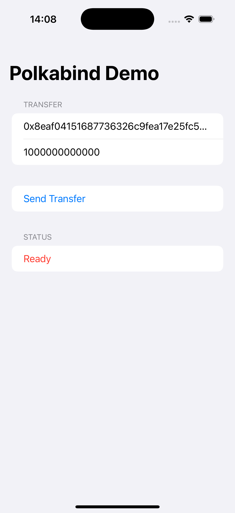
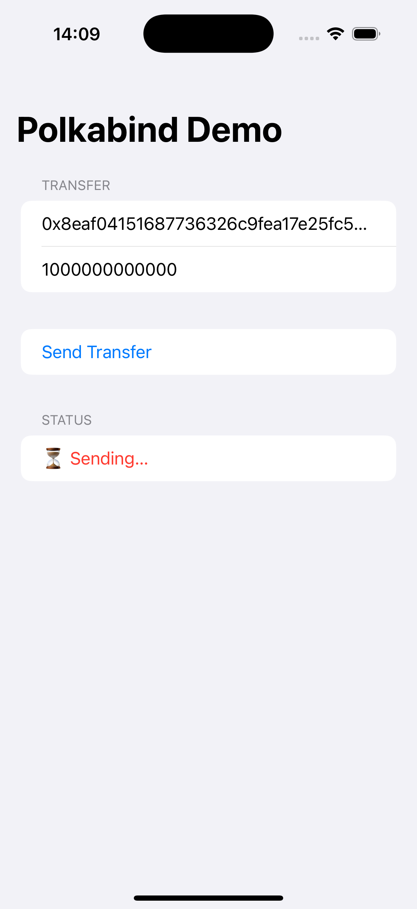
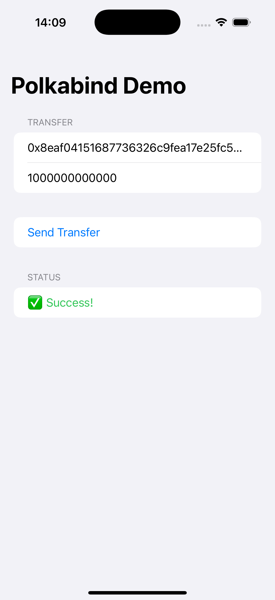
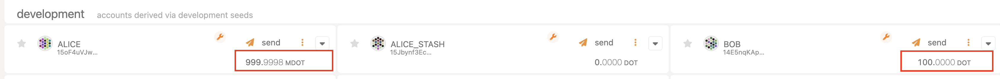

# Polkabind

**Seamless interaction with any Polkadot SDK based chain for Swift, Kotlin, Python and more!**

<p align="center">
  ⚠️ **Work in Progress** ⚠️
</p>

## Overview

`Polkabind` is a library that opens the Polkadot ecosystem to programming languages other than Rust. It exposes mainly standard wallet-level functionality (key management, balance queries, extrinsic building, signing, RPC, event subscriptions and more) to other languages (Swift, Kotlin, Python, Javascript and more) by exposing the **[Subxt](https://github.com/paritytech/subxt)** library through FFI (foreign language interface). 

## Why?

As of today, the **main** and **supported** languages that can be used to interact with a chain built on the Polkadot SDK are:

- *Rust*: primary and official through **Subxt**, **Polkadot SDK** and **FRAME**.
- *Javascript/Typescript*: widely used and community supported through tools like: **PAPI** and **PolkadotJS** and more.

Some projects tried to expose the same rich functionality for other languages, but many are way behind in terms of API exposure compared to Subxt. And still, it's really difficult to produce safe code in other languages compared to Rust, and especially compared to the established Rust cryptographic libraries used under the hood by Subxt and FRAME.

Subxt itself is the primary Rust/Webassembly based tool used to interact with Polkadot SDK based chains, and many community developer tools use it internally. But for a developer, other than the Rust language learning curve, Subxt adds to it its own learning curve because of it's rich API coverage and the complexity of the blockchain based interactions in general.

`Polkabind` tries to open the Polkadot ecosystem to other languages in a smart way by: 

- creating a façade/abstraction on top of Subxt itself: we use Subxt, we don't replace it. Subxt is our source of truth. The façade exposes mainly standard wallet-level functionality, no fancy interactions, at least for now.
- simplifying the developer experience: instead of crafting a big block of code using Subxt to do a simple transfer, Polkabind abstracts it to be a simple function exposed to other langugaes.
- the façade is translated to other languages through FFI (C ABI), the standard bridge between Rust and most runtimes.
- Polkabind will produce small ready-to-import libraries for major languages: Swift, Kotlin, Nodejs, Python and more. And later, those libraries will be published to each language package manager's repository: for Nodejs, it will be as simple as *npm install @polkabind/latest*. 
- If Subxt gains a new feature, a single Rust change in Polkabind automatically propagates to every supported language.


## High-Level Workflow

This is a high level workflow showcasing the production a Swift Polkabind package.

```mermaid
flowchart TD
  %% ──────────────────────────────────────────────
  %%  Repositories (left-to-right data flow)
  %% ──────────────────────────────────────────────
  subgraph CORE["**polkabind**  (Rust + Subxt façade)"]
    A[Push / Tag vX.Y.Z]
  end

  subgraph CORE_CI["Core repo CI  ( GitHub Actions )"]
    direction LR
    B1[Build<br/>⚙️ Rust dylib<br/> device + sim] --> B2[Generate Swift stubs<br/>🔧 UniFFI]
    B2 --> B3[Bundle xcframework<br/>+ Package.swift]
    B3 -->|git push files & tag| B4[Mirror into<br/>**polkabind-swift-pkg**]
  end

  subgraph SWIFT_REPO["**polkabind-swift-pkg**  (repo)"]
    C[New commit<br/>+ tag vX.Y.Z]
  end

  subgraph SWIFT_CI["Swift repo CI  ( GitHub Actions )"]
    D1[Zip package] --> D2[Create GitHub Release<br/>📦 polkabind-swift-pkg.zip]
  end

  subgraph CONSUMER["Developer / CI using SwiftPM"]
    E[Swift / iOS App<br/>adds SPM dependency<br/>→ fetches Release]
  end

  %% ──────────────────────────────────────────────
  %%  Link everything
  %% ──────────────────────────────────────────────
  A --> CORE_CI
  B4 --> C
  C --> SWIFT_CI
  D2 --> E

  %% ──────────────────────────────────────────────
  %%  Styling helpers
  %% ──────────────────────────────────────────────
  classDef repo      fill:#f9f9f9,stroke:#bbb;
  classDef pipeline  fill:#eef3ff,stroke:#87a9ff;
  classDef release   fill:#e8fce8,stroke:#78c878;

  class CORE,SWIFT_REPO repo
  class CORE_CI,SWIFT_CI pipeline
  class D2 release
  ```

# Show me the code

Here's what it looks like to use `Polkabind` in Swift:

## Classic Subxt (Rust)

``` rust
// build the address, compose the dynamic call,
// sign, submit, watch for finality …
let dst = Value::variant(
    "Id",
    Composite::unnamed(vec![Value::from_bytes(arr)]),
);
let client = OnlineClient::<PolkadotConfig>::from_url(url).await?;
let tx = dynamic_call(
    "Balances",
    "transfer_allow_death",
    vec![dst, Value::u128(amount)],
);
client
    .tx()
    .sign_and_submit_then_watch_default(&tx, &signer)
    .await?
    .wait_for_finalized_success()
    .await?;
```

## Polkabind (Swift)
```swift
// one blocking FFI call – done 🎉
try Polkabind.doTransfer(destHex: destHex, amount: amt)
```

Behind the scenes **Polkabind** executes that same Rust (left column) but
exposes a single, ergonomic Swift API.

# What’s in examples/ ?
A ready to launch iOS project, featuring a balance transfer of from *Alice*'s account to *Bob*'s account. You can check the accounts initial balances after launching a local node with Chopsticks (see below).

```
examples/
└── app/iOS/PolkabindExample
    ├── PolkabindExampleApp.swift   ← UIApplication entry-point
    └── ContentView.swift          ← 25-line demo UI shown below
```

SwiftUI snippet used in the the Swift example:

```swift
Button("Send Transfer") {
    status = "⏳ Sending…"
    Task.detached {
        do {
            try Polkabind.doTransfer(
                destHex: "0x8eaf…a48",
                amount: 1_000_000_000_000
            )
            status = "✅ Success!"
        } catch {
            status = "❌ \(error)"
        }
    }
}

```

## Quick local test

1. launch an instant-finality Polkadot dev chain using Chopsticks.
``` shell
npx @acala-network/chopsticks \
  --config=https://raw.githubusercontent.com/AcalaNetwork/chopsticks/master/configs/polkadot.yml \
  --build-block-mode Instant
```

2. open PolkabindExample.xcodeproj in Xcode.

3. Add the binary package:
  - Xcode →  Package Dependencies → «https://github.com/Polkabind/polkabind-swift-pkg»
  - Select the latest Release (tag vX.Y.Z).
  - Link “Polkabind” to your app target (Xcode does this automatically when you tick the checkbox).
  
4. run on a simulator.

5. tap "Send Transfer":
  - In the simulator you’ll see ✅ Success!; in the Chopsticks console the extrinsic is instantly finalised.
  
<p align="center">
  
  
  
</p>

<p align="center">
  
</p>

That’s all: no Rust toolchain, no Subxt boilerplate, just a tiny binary framework you can ship in any iOS app.

## Status

This is a *work-in-progress*, please visit [polkabind.dev](https://polkabind.dev) for a summary of the expected roadmap.
